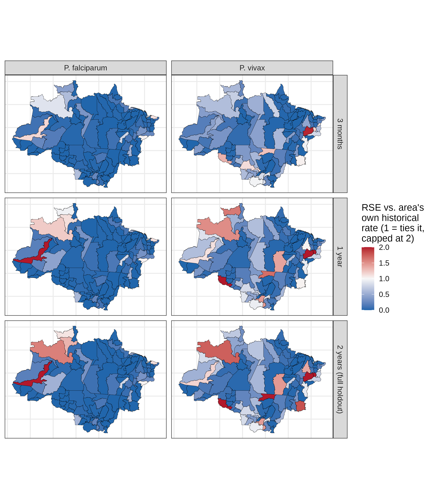
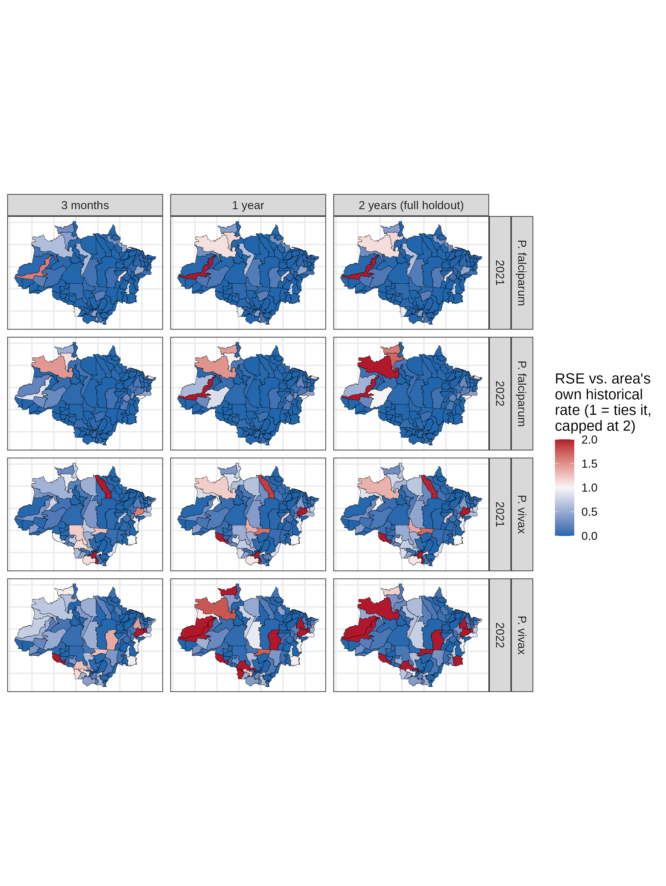
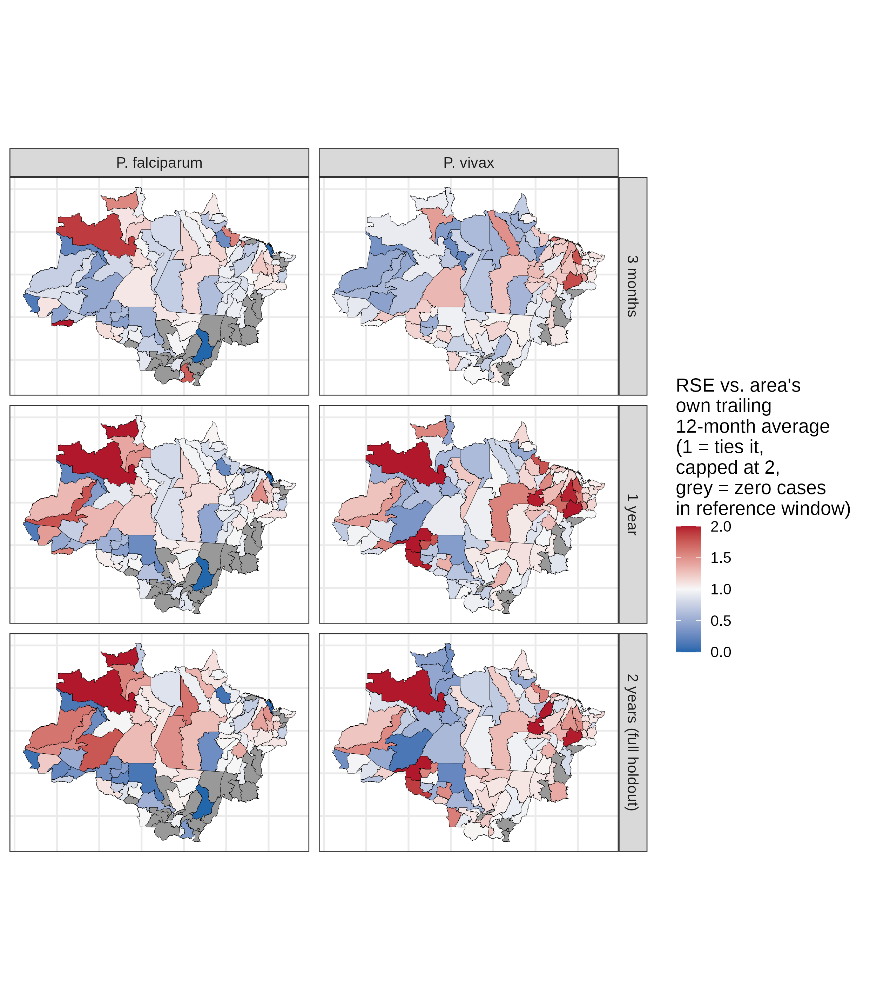
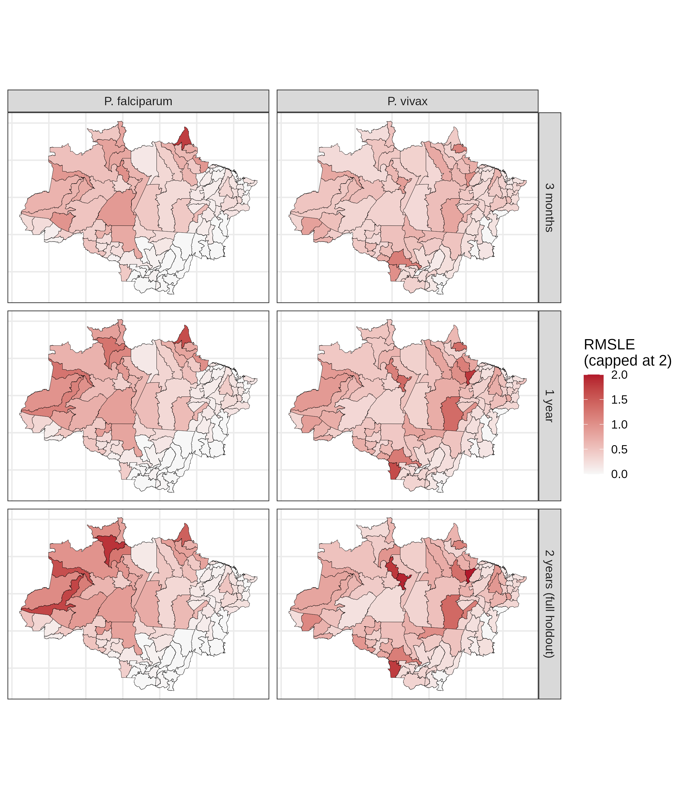
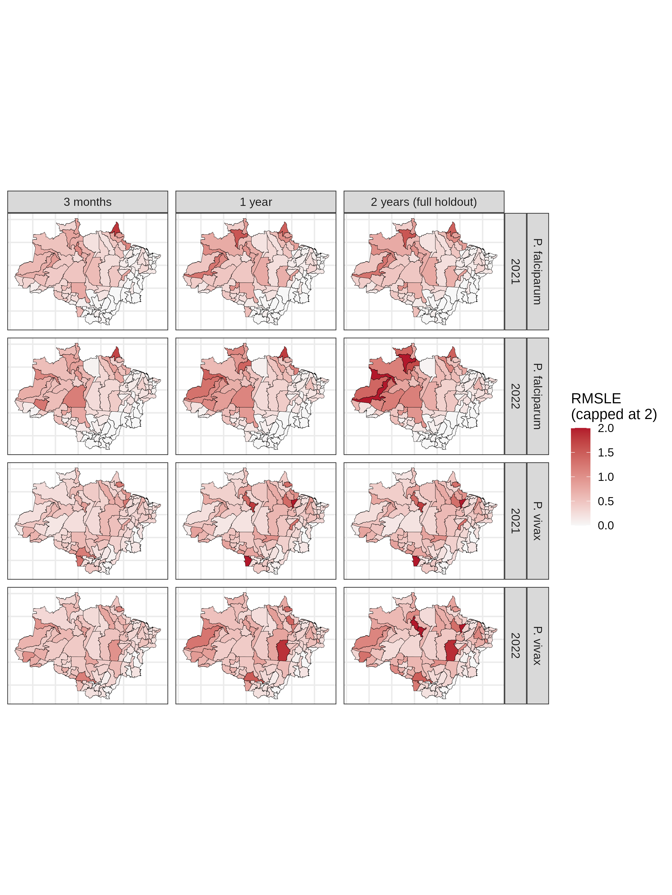

# Malaria in the Brazilian Legal Amazon — Bayesian space-time modeling

Bayesian spatio-temporal modeling of *P. vivax* and *P. falciparum* incidence
across the 107 microregions of the Legal Amazon (9 states), 2003-2022,
fit with INLA. Written for a Scientific Reports revision. This document
summarizes what each stage of the pipeline does, what we found, and known
limitations. The scripts themselves carry no comments, so this is the
documentation.

## Pipeline

| Script | Purpose |
|---|---|
| `0.download_data.R` | Fetch and cache all raw sources |
| `1.data_wrangling.R` | Build the microregion x month analysis panel |
| `2.1.eda.R`, `2.2.eda.R` | Exploratory figures and covariate screening |
| `2.3.model_iteration.R` | CV harness developing the Bell model's functional form |
| `3.family_comparison.R` | Same functional form under Poisson / Negative Binomial |
| `4.holdout_evaluation.R` | First use of the untouched 2021-2022 holdout |
| `5.holdout_error_maps.R` | Spatial diagnostics on the holdout errors |
| `scripts/legacy/` | Pipeline behind the originally submitted paper, superseded (kept for reference) |

Run in that order. Each script is idempotent (skips work whose output
already exists on disk), except `1.data_wrangling.R`.

## 0. Data acquisition

Sources: case notifications from a public Mendeley Data deposit (DOI
`10.17632/9n6b97fsbd.2`, species-coded, municipality-month grain);
population from IBGE/SIDRA; deforestation from INPE PRODES; precipitation,
temperature and dewpoint from ERA5 (login required); health facility counts from
DataSUS/CNES (monthly FTP snapshots); microregion boundaries from IBGE's
shapefile. Everything is cached to disk and only re-downloaded if missing.

Population isn't available from SIDRA for every year and municipality
(census years use a different table than the annual estimates, and some
municipalities are missing individual years). Gaps are filled per
municipality by linear interpolation, with the nearest known value held
constant outside the observed range. A municipality with fewer than two
real data points is left as is, since there's nothing to interpolate
from.

**Limitation:** CNES has no source at all for 2003-2004. Left as `NA`,
never imputed.

## 1. Data wrangling

Aggregates municipality-month case counts to microregion x month, filters
to the 9 Legal Amazon states, and builds the adjacency graph INLA needs
for any spatially-structured random effect. Rate is always cases per
100,000 inhabitants: raw counts aren't comparable across microregions of
very different population.

`hotspots` is a time-varying feature (months in the prior 3 years at or
above that species' own top-1% rate), built into the panel here but not
used as a covariate anywhere in `2.3.model_iteration.R` or
`3.family_comparison.R`. The static, whole-period version of the same
idea (`results/eda/hotspots_ranking.csv`, from `2.1.eda.R`) is what
actually gets used, in §4 & §5's hotspot-vs-rest breakdown.

## 2.1 / 2.2 — Exploratory analysis

Motivates the modeling choices before any model is fit:

- **Overdispersion** far beyond what a Poisson process would produce, for
  both species. Motivates Bell/Negative Binomial over plain Poisson.
- **Seasonality**: a real Jan-Mar peak, consistent across years.
- **Chronic spatial hotspots**: a small, stable set of microregions
  responsible for a disproportionate share of extreme-rate months. These
  turn out later to be the model's hardest holdout cases too (§5).
- **Covariate screening** (deforestation, precipitation, temperature,
  humidity, CNES facility types): rate ratios and deviance tests against
  a GLM baseline (`factor(microregion) + ns(year) + factor(month)`)
  motivate which covariates are worth carrying into the real model.

**Limitation:** this screening used the old GLM baseline, not the
eventual winning space-time structure. A covariate's apparent signal here
could in principle be fully absorbed once real space-time structure is in
the model. It's re-tested inside the actual structure in §2.3/§3, so this
isn't blind, but the screening result on its own shouldn't be over-read.

## 2.3 — Functional form (Bell family fixed)

Rolling CV, always an expanding training window, always refit before
forecasting: idMes 109-216 (2012-2020) rolling for structure iteration,
idMes 217-240 (2021-2022) never touched here (`IDMES_HOLDOUT`).

Built up Model 0 (intercept only) through Model 6:

- **Model 3** (backbone): separate main terms for space (`iid`), year
  trend (`ar1`), and month cycle (`rw2` cyclic), plus two interactions:
  area x year and area x month (the second needs a sum-to-zero
  constraint to stay identifiable). Beats every simpler structure tried,
  including a single combined Kronecker term and the paper's own
  interaction design.
- **`iid` beats `bym2`** for the spatial term in every configuration
  tested (main term alone, inside each interaction, combined). bym2's own
  mixing parameter came out around 0.23 in a direct check, so it's mostly
  unstructured anyway. `iid` is used everywhere, at a fraction of the
  compute.
- **Model 5**: adds deforestation (as a natural spline, better
  than linear), precipitation, temperature, and humidity as flat fixed
  effects.
- **Model 6**: adds a species-specific CNES facility-type covariate. Not
  adopted: no robust improvement over Model 5 on the full CV. 
  Kept as a secondary candidate.
- Two CV regimes run for the final candidates: quarterly refit (36
  folds, `step=3`, cycling every calendar quarter) and annual refit
  (single fit per year, no mid-course update). The quarterly design
  replaced an earlier step=12 version that only ever tested Jan-Mar and
  hid a lot of quarter-dependent variation.

**Limitation:** covariate credibility was checked on the full training
data (all coefficients' 95% credible intervals excluded 0), not
re-verified per fold. A covariate could in principle be credible overall
while not adding real predictive value in every fold.

Mean across the quarterly-refit CV folds, `results/model_iteration/iteration_metrics.csv`:

| Model | Species | DIC | RSE | cor | coverage_95 | width_95 |
|---|---|---|---|---|---|---|
| glm_sem_covariaveis | P. falciparum | NA | 0.616 | 0.644 | 0.600 | 7.9 |
| glm_sem_covariaveis | P. vivax | NA | 0.489 | 0.774 | 0.434 | 20.9 |
| model0_intercept | P. falciparum | 994,782 | 1.161 | 0.066 | 0.127 | 33.2 |
| model0_intercept | P. vivax | 2,515,452 | 1.025 | 0.075 | 0.066 | 75.9 |
| model1_iid_ar1_ano | P. falciparum | 100,206 | 0.209 | 0.934 | 0.940 | 22.6 |
| model1_iid_ar1_ano | P. vivax | 169,320 | 0.235 | 0.901 | 0.845 | 110.6 |
| model2_bym2_ar1_ano | P. falciparum | 100,184 | 0.222 | 0.934 | 0.942 | 22.1 |
| model2_bym2_ar1_ano | P. vivax | 169,346 | 0.249 | 0.900 | 0.846 | 107.6 |
| model3_separated_iid | P. falciparum | 88,835 | 0.219 | 0.939 | 0.944 | 24.1 |
| model3_separated_iid | P. vivax | 136,972 | 0.165 | 0.937 | 0.861 | 115.5 |
| model4_covariates | P. falciparum | 88,681 | 0.219 | 0.938 | 0.942 | 23.3 |
| model4_covariates | P. vivax | 136,659 | 0.165 | 0.938 | 0.860 | 111.8 |
| model5_defor_ns (adopted) | P. falciparum | 88,686 | 0.213 | 0.939 | 0.942 | 23.0 |
| model5_defor_ns (adopted) | P. vivax | 136,661 | 0.161 | 0.938 | 0.861 | 110.6 |
| model6_cnes | P. falciparum | 88,685 | 0.212 | 0.939 | 0.942 | 22.9 |
| model6_cnes | P. vivax | 136,662 | 0.162 | 0.938 | 0.860 | 107.7 |
| paper_best_replica | P. falciparum | 158,798 | 0.652 | 0.652 | 0.804 | 13.4 |
| paper_best_replica | P. vivax | 124,328 | 0.800 | 0.786 | 0.927 | 200.5 |

Models 4 through 6 are all within noise of each other on every metric in
this table. Model 5 is what we carried forward, mainly for the
defor_lag2 spline result, but nothing in this CV cleanly rules out 4,
or 6 either. Worth stating plainly rather than letting the table imply a
decisive winner.

**Credible intervals**: `summary.fitted.values`'s own quantiles only
cover mean-function uncertainty, not observation noise, so intervals are
built from `inla.posterior.sample()` draws of the linear predictor
instead. For Bell specifically this needs an extra step: its exact pmf
needs the y-th Bell number, which overflows well before the case counts
seen here, so there's no way to sample directly from it. Each posterior
draw of `mu` is converted to Bell's own mean/variance (`mean = theta *
exp(theta)`, `theta` from the Lambert W function of `mu`), and a new
observation is drawn from a normal approximation at that exact mean and
variance. Poisson and Negative Binomial don't need this: `rpois()` and
`rnbinom()` sample from the real distribution directly.

## 3. Family comparison

Same winning structure (§2.3), same CV design, testing Poisson and
Negative Binomial instead of Bell. `results/best_models.csv` holds the
winner per family/species.

Key finding: **coverage drops outside Jan-Mar**, most for vivax. Bell's
worst quarter lands at 0.92 for falciparum, close enough to nominal to be
noise, but 0.80 for vivax, a real 15-point miss. Poisson shows the same
pattern in both species, more severely (0.86 falciparum, 0.67 vivax).
Both families have a mean-variance relationship fixed by the
distribution, which doesn't match the higher dispersion seen the rest of
the year. Negative Binomial's free dispersion parameter fixes this in
both species. Confirmed independent of the `int.strategy` (`eb` vs `ccd`)
INLA integration setting, and independent of `num.threads`.

Negative Binomial is also the heaviest, least stable fit in the whole
pipeline. The kernel OOM-killer repeatedly killed the INLA process
mid-fit here, which is why every CV script sets `num.threads = '2:1'`
instead of full parallelism. INLA also crashed outright, independent of
memory pressure, or converged to a numerically degenerate fit (`cor <
0.3` or `rse > 5`) without raising an error at all.
`results/family_comparison/models/retry_log.csv` has 13 such events (7
crashes, 6 degenerate), all Negative Binomial, all falciparum, split
across Model 5 and Model 6; `results/holdout/models/retry_log.csv` has
one more, same pattern. Bell's own retry log (would be
`results/model_iteration/models/retry_log.csv`) never needed to exist.
Every fold checkpoints to disk as it completes, and every one of these
events triggers one cold retry without the previous fold's warm start.

**No single family wins uniformly.** Always compare `|coverage_95 -
0.95|` (distance from the calibration target), not raw coverage
magnitude, since over-covering is also miscalibration. Which family
looks best depends on species and refit regime.

Winning model per family/species, quarterly-refit CV, `results/best_models.csv`:

| Family | Species | Model | DIC | RSE | cor | coverage_95 | width_95 |
|---|---|---|---|---|---|---|---|
| bell | P. falciparum | model5 | 89,211 | 0.135 | 0.956 | 0.942 | 11.5 |
| bell | P. vivax | model5 | 136,226 | 0.138 | 0.941 | 0.850 | 52.2 |
| poisson | P. falciparum | model5 | 77,398 | 0.131 | 0.953 | 0.883 | 6.2 |
| poisson | P. vivax | model5 | 40,396 | 0.141 | 0.941 | 0.720 | 23.7 |
| nbinomial | P. falciparum | model5 | 86,260 | 0.152 | 0.953 | 0.975 | 27.9 |
| nbinomial | P. vivax | model5 | 128,484 | 0.145 | 0.938 | 0.942 | 161.6 |

On this validation CV, Bell and Poisson actually has the better RSE overall, and Negative
Binomial trails both in every row (0.152 / 0.145) -- a real gap, though
a modest one (5-13% relative). Taken alone, that table would argue for
Bell (better coverage than Poisson), not Negative Binomial. 
This doesn't hold up once you split by
chronic hotspot status (`results/eda/hotspots_ranking.csv`, same set
used in §5), `results/family_comparison/metrics_by_hotspot.csv`:

| Scenario | Family | Species | n | RSE | cor | coverage_95 | width_95 |
|---|---|---|---|---|---|---|---|
| hotspots | bell | P. falciparum | 12 | 0.275 | 0.855 | 0.850 | 116.0 |
| hotspots | bell | P. vivax | 11 | 0.261 | 0.864 | 0.641 | 643.0 |
| hotspots | poisson | P. falciparum | 12 | 0.285 | 0.850 | 0.710 | 101.0 |
| hotspots | poisson | P. vivax | 11 | 0.269 | 0.860 | 0.429 | 547.0 |
| hotspots | nbinomial | P. falciparum | 12 | 0.266 | 0.862 | 0.943 | 208.6 |
| hotspots | nbinomial | P. vivax | 11 | 0.272 | 0.862 | 0.950 | 1225.0 |
| excl. hotspots | bell | P. falciparum | 95 | 0.246 | 0.869 | 0.954 | 11.3 |
| excl. hotspots | bell | P. vivax | 96 | 0.271 | 0.859 | 0.886 | 49.5 |
| excl. hotspots | poisson | P. falciparum | 95 | 0.255 | 0.864 | 0.912 | 9.4 |
| excl. hotspots | poisson | P. vivax | 96 | 0.292 | 0.850 | 0.793 | 39.0 |
| excl. hotspots | nbinomial | P. falciparum | 95 | 0.243 | 0.875 | 0.969 | 16.2 |
| excl. hotspots | nbinomial | P. vivax | 96 | 0.234 | 0.876 | 0.940 | 85.4 |

Two things happen at once at hotspots. First, Bell and Poisson's RSE
edge disappears: Negative Binomial actually has the best RSE of the
three for falciparum there (0.266 vs. 0.275 and 0.285), and is within
0.01 of Bell for vivax (0.272 vs. 0.261). The overall-CV gap that
favored Bell was coming entirely from the non-hotspot majority (95-96 of
107 microregions), not from Negative Binomial being a worse model where
it's actually hard. Second, and more decisively: coverage_95 splits
hard. Away from hotspots all three families stay in a defensible range
(0.79-0.97). At hotspots, Poisson's coverage collapses (0.71 falciparum,
**0.43 vivax**, under half nominal), Bell degrades too (0.85 / 0.64),
and only Negative Binomial holds close to 0.95 in both species (0.94 /
0.95) — at the cost of a much wider interval there (209-1225 vs 101-643
for the other two).

So the honest summary: on raw point-prediction accuracy, Bell is the
better model overall, by a modest but real margin, and that alone would
argue for it. It loses that edge specifically where the disease burden
actually concentrates, and it's badly miscalibrated there on top of it.
Negative Binomial gives up a little accuracy on the easy majority of
microregions in exchange for not breaking calibration on the hard ones.
That trade, not a uniform win, is why §4/§5 run it for both species.

## 4. Holdout evaluation

The first and only use of 2021-2022 for genuine out-of-sample scoring.
Rolling CV *within* the holdout at three horizons: 3-month (8 folds,
tiles both years), 1-year (2 folds, one refit between years), 2-year (1
fold, a single fit covering the whole holdout with no refit at all). All
folds train on real data only, expanding forward, never on the model's
own past predictions.

Median across holdout folds, Negative Binomial / Model 5, `results/holdout/models/`:

| Horizon | Species | RSE | cor | coverage_95 | dist from 0.95 | width_95 |
|---|---|---|---|---|---|---|
| 3-month | P. falciparum | 0.172 | 0.931 | 0.975 | 0.025 | 23.8 |
| 3-month | P. vivax | 0.128 | 0.944 | 0.953 | 0.003 | 118.7 |
| 1-year | P. falciparum | 0.399 | 0.876 | 0.985 | 0.035 | 64.1 |
| 1-year | P. vivax | 0.243 | 0.899 | 0.957 | 0.007 | 326.7 |
| 2-year | P. falciparum | 0.523 | 0.801 | 0.988 | 0.038 | 76.3 |
| 2-year | P. vivax | 0.256 | 0.882 | 0.958 | 0.008 | 422.8 |

RSE stays well under 1 and coverage never drifts far from 0.95 at any
horizon, for either species, on data none of the model/family selection
in §2.3/§3 ever touched. Correlation drops some at the 2-year horizon
for falciparum (0.801, the weakest cell here), consistent with §5's
finding that a handful of specific microregions drive most of the
degradation at longer horizons.

## 5. Spatial error diagnostics

Maps error by microregion and forecast horizon, for the winning holdout
model (Negative Binomial, Model 5). Two RSE baselines, because the
choice matters a lot:

1. **Own historical rate** (`map_errors_rse.png`, `map_errors_trend_rse.png`):
   each microregion's own case rate, computed only from data available at
   that fold's training cutoff. This is an expanding window, the same
   clock the model itself uses, never the mean of the months being
   predicted, which would be an oracle baseline no real forecaster could
   compute. The model beats this baseline by a wide margin almost
   everywhere (pooled SSE ratio 0.12-0.25, a 75-88% error reduction).

   
   

2. **Trailing 12-month moving average** (`map_errors_rse_vs_ma12.png`):
   a much harder, more reactive baseline, updated with the same recent
   real data the model gets. Microregions with genuinely zero incidence
   in both the reference window and the test period are excluded from
   the win/loss tally below, since RSE is 0/0 there. The model's own
   predictions in these areas are negligible (about 0.001-0.03
   cases/100k), so this is a metric artifact, not a real miss.

   

RMSLE (`map_errors_rmsle.png`, `map_errors_trend_rmsle.png`) is kept as a
second, baseline-free metric, since it doesn't depend on which naive
comparison is deemed fair. It has no cases/100k unit of its own (it's
built from `log(real+1) - log(pred+1)`, a ratio, not a difference of
rates): read it as a typical multiplicative gap between predicted and
real, `exp(RMSLE)`. The cap at 2 is `exp(2) ≈ 7.4x`, e.g. predicting 10
cases/100k when the real rate is around 74, or the reverse.

The pooled SSE ratio against the moving average is dominated by a
handful of outlier microregions, so `results/holdout/rse_vs_ma12_summary.csv`
instead reports, per microregion, whether the model beats the moving
average (win/loss tally) and the median RSE and RMSLE across
microregions, split into the full set, chronic hotspots only
(`results/eda/hotspots_ranking.csv`), and everything else:

| Species | Horizon | Scenario | n | model wins | median RSE | median RMSLE |
|---|---|---|---|---|---|---|
| P. falciparum | 3-month | hotspots | 12 | **75%** | 0.874 | 0.707 |
| P. falciparum | 3-month | full | 85 | 65% | 0.946 | 0.161 |
| P. falciparum | 3-month | excl. hotspots | 73 | 63% | 0.947 | 0.142 |
| P. falciparum | 1-year | hotspots | 12 | **75%** | 0.924 | 0.797 |
| P. falciparum | 1-year | full | 85 | 61% | 0.961 | 0.168 |
| P. falciparum | 1-year | excl. hotspots | 73 | 59% | 0.973 | 0.144 |
| P. falciparum | 2-year | hotspots | 12 | **67%** | 0.847 | 0.871 |
| P. falciparum | 2-year | full | 85 | 52% | 0.998 | 0.168 |
| P. falciparum | 2-year | excl. hotspots | 73 | 49% | 1.004 | 0.146 |
| P. vivax | 3-month | hotspots | 11 | **82%** | 0.726 | 0.449 |
| P. vivax | 3-month | full | 101 | 53% | 0.978 | 0.350 |
| P. vivax | 3-month | excl. hotspots | 90 | 50% | 1.002 | 0.335 |
| P. vivax | 1-year | hotspots | 11 | **64%** | 0.931 | 0.607 |
| P. vivax | 1-year | full | 101 | 47% | 1.024 | 0.391 |
| P. vivax | 1-year | excl. hotspots | 90 | 44% | 1.032 | 0.368 |
| P. vivax | 2-year | hotspots | 11 | **64%** | 0.653 | 0.631 |
| P. vivax | 2-year | full | 101 | 46% | 1.023 | 0.391 |
| P. vivax | 2-year | excl. hotspots | 90 | 43% | 1.044 | 0.349 |

Two things worth separating here. First, the model beats the moving
average at hotspots more often than everywhere else, not less: 64-82% of
hotspot microregions, against a coin flip or worse outside them. The
pooled ratio shown in the map hides this, since it sums squared errors
before dividing and a couple of the worst hotspots dominate
that sum even though most hotspots individually do fine. Second, losing
to the moving average outside hotspots doesn't mean the prediction is
bad: RMSLE there is low (0.14-0.17 falciparum, 0.33-0.37 vivax), 4-6x
lower than at hotspots. Those microregions are low-incidence and stable
enough that a 12-month average is already a strong predictor, so there's
little room for any model to add value. The real headroom is at the
hotspots, where RMSLE stays high even where the model wins.

Put together: the space-time structure is doing real work, and it's
doing that work specifically where it's hardest (the hotspots), not
padding its numbers on the easy majority of microregions where a naive
average would do almost as well.

## `scripts/legacy/`

The pipeline behind the version of the paper originally submitted for
review: per-microregion Bell/Poisson/NB fits, a single blind 2016+
forecast window (not rolling CV), and a separate error-correction
post-processing step. Superseded by `2.1.eda.R` onward, which uses a
fairer rolling-CV design and found a better functional form. Kept for
reproducibility of the originally submitted numbers, not maintained
further.

## Known limitations, cross-cutting

- Deforestation is the only land-use covariate. Nothing captures illegal
  mining activity specifically, which is the single largest source of
  spatial error found (§5).
- CNES (health-facility access) never proved a robust addition to
  predictive accuracy despite being individually credible, so it was
  dropped from the adopted model.
- No family wins uniformly across species and refit cadence. The choice
  reported in the paper should state which regime it's optimized for.
- The moving-average sanity check (§5) shows the space-time structure's
  advantage over a trivial reactive baseline is real but modest: roughly
  a coin flip per microregion, tilting toward the model at shorter
  horizons. This is a more honest framing than the pooled aggregate
  metrics alone would suggest.
